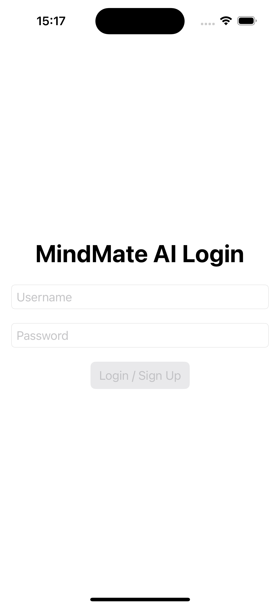
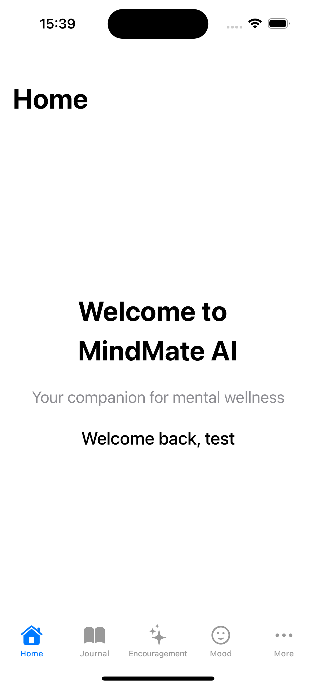
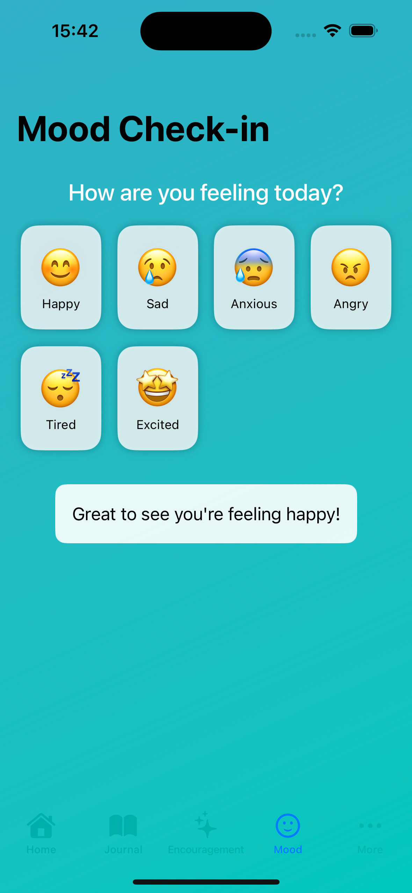
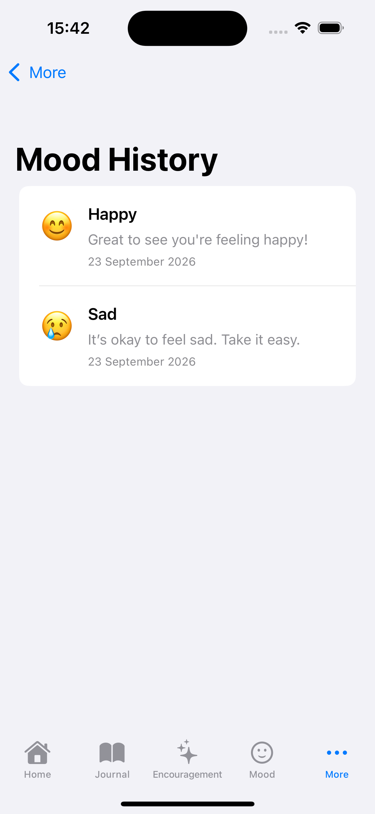
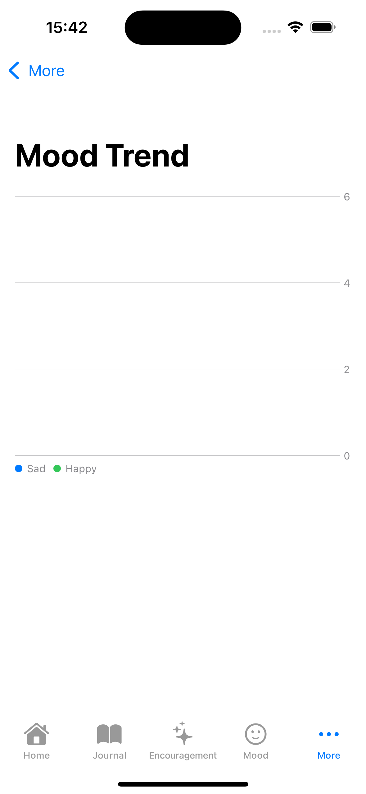
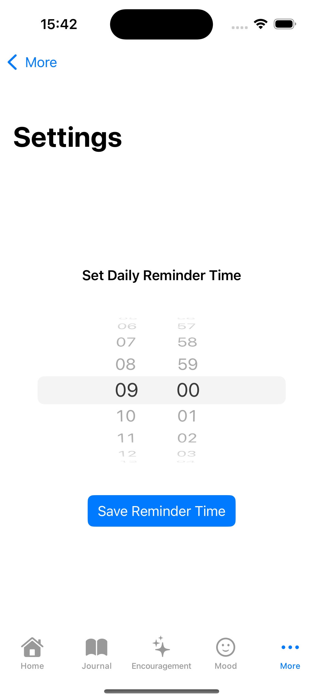

# MindMateAI


MindMateAI is a privacy-focused iOS wellness application built with SwiftUI. It helps users record their daily moods, write journal entries, view mood history and trends, receive positive encouragement, and schedule daily reflection reminders.

*Note: This project was created as a portfolio project to demonstrate iOS development skills, UI design, data persistence, and Apple platform technologies.*

---

## Features
- Personalised onboarding experience
- Local username and password storage using Keychain
- Daily mood check-ins
- Mood history with emoji, messages, and timestamps
- Mood trend visualisation using Apple Charts
- Personal journaling with Core Data persistence
- Daily encouragement based on the selected mood
- Feedback rating for encouragement messages
- Configurable daily journal reminders
- Profile and sign-out functionality
- Local data storage without requiring a remote server

---

## Screenshots

| Login | Home | Mood Check-in |
| :---: | :---: | :---: |
|  |  |  |

| Mood History | Mood Trends | Settings |
| :---: | :---: | :---: |
|  |  |  |

---

## Technologies
- **Language:** Swift
- **UI Framework:** SwiftUI
- **Persistence:** Core Data
- **Data Visualisation:** Apple Charts
- **Security:** Keychain Services
- **Notifications:** UserNotifications
- **CI / CD:** GitHub Actions (`macos-latest`)
- **Testing:** Swift Testing, XCTest

---

## Project Structure
MindMateAIApp/
├── MindMateAIApp/
│   ├── ContentView.swift
│   ├── MindMateAIAppApp.swift
│   ├── JournalEntry.swift
│   ├── MoodHistoryView.swift
│   ├── MoodTrendView.swift
│   ├── Helpers/
│   │   ├── KeychainHelper.swift
│   │   └── NotificationManager.swift
│   ├── Persistence/
│   │   └── Persistence.swift
│   └── Views/
│       ├── EncouragementView.swift
│       ├── HomeView.swift
│       ├── JournalView.swift
│       ├── Mood.swift
│       ├── OnboardingView.swift
│       ├── ProfileView.swift
│       └── SettingsView.swift
├── MindMateAIAppTests/
├── MindMateAIAppUITests/
└── MindMateAIApp.xcodeproj/


## Requirements
- macOS
- Xcode 16 or later
- iOS 18.0 or later
- An iPhone simulator or physical iOS device

---

## Getting Started

1. **Clone the repository:**
   ```bash
   git clone [https://github.com/Kasidej31-bit/MindMateAI.git](https://github.com/Kasidej31-bit/MindMateAI.git)

How It Works
Mood Tracking
Users select a mood from the available options. The app saves the selected mood, emoji, message, and timestamp to Core Data.

Journaling
Users can write personal journal entries. Journal entries are stored locally using Core Data and displayed in reverse chronological order.

Mood Insights
The application displays saved moods in a history list and provides a visual trend chart using Apple Charts.

Reminders
Users can select a preferred reminder time. The app uses UserNotifications to schedule a daily local notification encouraging the user to complete a journal entry.

Local Storage
Core Data: Stores journal entries and mood records.

AppStorage: Handles lightweight preferences like username and reminder settings.

Keychain Services: Manages local credential storage.

Automated Testing & Continuous Integration
This project includes unit testing executed automatically via GitHub Actions on a macos-latest runner upon pushing to main.

Test Coverage Focus
Journal entry validation and empty entry safeguards

Core Data mood entry persistence

Reminder configuration logic

App navigation and state initialization

Running Tests Locally
Open the project in Xcode and press ⌘ + U (or select Product > Test).

Privacy
MindMateAI is designed as a local-first prototype. Mood records and journal entries are stored locally on the device and are not sent to a remote server.

This project does not currently include:

Cloud synchronisation

Remote user accounts

Password recovery

Server-side authentication

End-to-end encryption

Medical or clinical functionality

The application is intended for personal reflection and is not a replacement for professional mental health advice or emergency services.

Known Limitations
Authentication is local to the device without remote password recovery.

Journal and mood entries do not yet support editing or inline deletion.

Accessibility (VoiceOver) and internationalisation (localization) can be expanded.

Mood chart values are simplified for demonstration purposes.

Future Improvements
Add Face ID / Touch ID authentication

Add entry editing and deletion support

Expand unit test suite coverage

Add full data export functionality (JSON / CSV)

Support Dynamic Type and VoiceOver accessibility labels

Author
Developed by Kasidej31-bit as a junior iOS development portfolio project.
